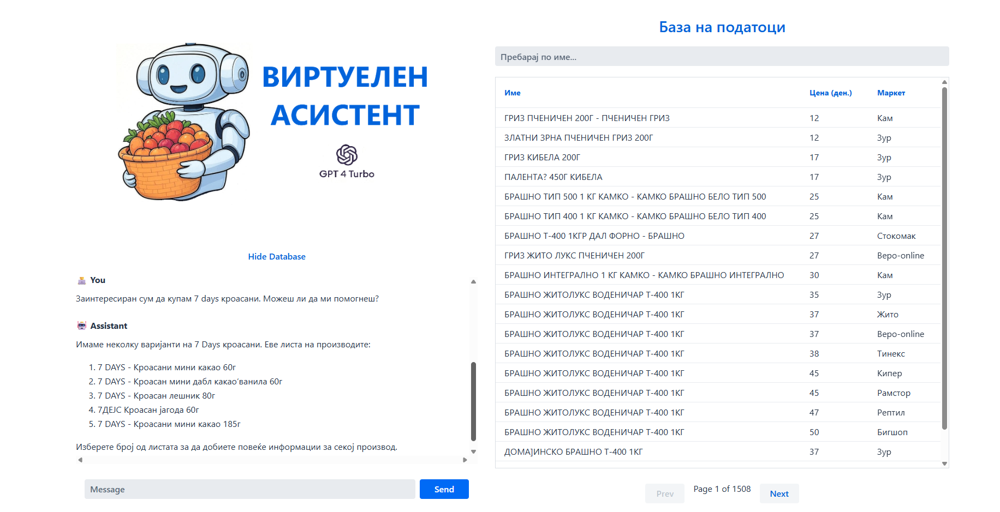

# Java AI Chatbot App

## This app is an AI-powered customer support application that:

- Has access to terms and conditions (retrieval augmented generation, RAG)
- Can access tools (Java methods) to perform actions
- Uses an LLM *(GPT-4-Turbo)* to interact with the user and embed product names.
- Scrapes info on Macedonian products from [ceni.mk](https://ceni.mk/)

## Requirements
- Java 17+
- OpenAI API key in `OPENAI_API_KEY` environment variable (*As of Sept 2025, you are required to have OpenAi credits in order to use your generated api key*)
- Docker

## Description
 **The Goal of this app was to create a chatbot that has access to prices of Macedonian products and can help the user find their desired product.** 

 To achieve this goal we used [Vaadin Hilla](https://vaadin.com) to help with the UI which uses React, and we used Spring Boot for the backend. The use of Vaadin also helped us to keep the project compact by enabling us to have both the frontend and backend in the same project.

 #### DATA
 First off, we needed data to work with. [ceni.mk](https://ceni.mk/) is a site by [Здравко Тодоров](https://www.linkedin.com/in/z-todorov/) where you can find prices for Macedonian products, fuel, electricity and other similar data which can be helpful to the Macedonian population. For our project we needed the data on the products, which we assume he scrapes from the individual supermarket's websites. This helped us greatly since we have to scrape 1 site instead of few.
 So we built a [Scraper](src/main/java/backend/service/ScraperService.java) where we scraped data such as the name of the product, the price and the market where the product is sold. We store this data in a postgres database in a docker container. As of the last run, we had 30,150 records in our database. We needed to implement [Standardization](src/main/java/backend/service/ProductStandardizationService.java) since the data we scraped varied one from another. For example there was a mismatch in the measurement system, some markets used 'KG' and others 'К', some were in Macedonian (Cyrillic alphabet) and others in English (Latin alphabet). We used [Scheduling](src/main/java/backend/service/ScheduledTasks.java) to scrape the data, currently it's set on every day at 4 in the morning

 #### PRODUCT SERVICES
 We used Spring Data JPA to help us with the product services and repositories. 

 #### AI
 Before we began coding the project we decided that we'll go with some of the OpenAi's models. I used [LangChain4J](https://docs.langchain4j.dev/) to help implement the model and all the necessary stuff for this to work. I realized that you need to pay to use OpenAi's models (*was expecting a free trial*) so I switched to [Ollama](https://ollama.com/) because I wanted a solution which wouldn't force me to pay for services. This way I could run LLM models on my machine. I tried 3 models and each had its own issues:  
 - **deepseek-r1:1.5b** Problem: Couldn't interact with tools (*no function calling*)
 - **llama3.1:8b** Problem: Used too much ram, and it took ~10+ seconds to respond which is unacceptable.
 - **qwen2.5:3b** Problem: Worked okay, but It didn't really understand the Macedonian language, it mixed it with other languages that use the Cyrillic alphabet.  
  
This led me to scrap the idea of using local LLM's which were ran on docker as well, and go back to using APIs.

I settled for the **GPT-4o** model, and for the embeddings I used **text-embedding-3-small**. I used a new database using pgvector to store the unique product names. From the ~30k records, there were ~20k unique product names. One solution was to use only one database and have a separate field for the vector representation of the text, but using OpenAi's embedding model it took me around 6 hours to embed all 20k unique names, so I chose a separate database.

## Created By  
- **Matej Bangievski (221233)**
- **Stefan Angjelkovski (221198)**